# 💇 Projeto: Salão ITEAM Beauty
### ITEAM | Curso de Capacitação em Desenvolvimento Full Stack
### Programação em Python | Módulo 5 — Programação Orientada a Objetos

---

## 📋 Sobre o Projeto

Você vai receber um sistema de gestão para um **Salão de Beleza & Barbearia**
com **14 bugs espalhados** pelo código. Sua missão é identificar, entender e corrigir
cada um deles, aplicando os conceitos de POO estudados.

> **Regra de ouro:** leia o comentário de `BUG` no arquivo antes de corrigir.
> Cada bug tem uma dica. Só consulte o gabarito depois de tentar por conta própria!

---

## 📊 Diagrama de Classes



### Entendendo o diagrama

O diagrama acima é um **mapa de decisões de design**. Cada seta e cada tipo de conexão
representa uma escolha consciente do programador sobre como as classes se relacionam.

---

#### 🔵 Herança — "É UM"

No topo do diagrama está `Pessoa`. Tanto `Funcionario` quanto `Coordenador` apontam para
ela com **setas tracejadas e triângulo vazado** — o símbolo de herança.

Isso significa: um `Funcionario` **é uma** `Pessoa`. Um `Coordenador` **é uma** `Pessoa`.
Eles herdam automaticamente nome, CPF, telefone e os métodos `@property`. No código,
isso se expressa com `super().__init__()`:

```python
class Funcionario(Pessoa):
    def __init__(self, nome, cpf, telefone, cargo, salario_base):
        super().__init__(nome, cpf, telefone)  # repassa para Pessoa
        self.cargo = cargo
```

> **Regra prática:** use herança quando a frase "X **é um** Y" fizer sentido no mundo real.
> Um `Coordenador` é um `Funcionario`? Sim — então `Coordenador(Funcionario)` é correto.

---

#### 🟣 Realização de Interface — "Se compromete a ser"

`EquipeCabelo`, `EquipeManicure` e `EquipeSpa` também usam setas tracejadas com triângulo
vazado, mas apontam para `Equipe` — que é uma **classe abstrata (interface)**.

`Equipe` herda de `ABC` do Python e declara métodos com `@abstractmethod`. Isso cria um
**contrato**: qualquer classe que herde de `Equipe` é obrigada a implementar
`descricao_servicos()` e `realizar_servico()`. Se não implementar, o Python recusa
instanciar o objeto.

```python
from abc import ABC, abstractmethod

class Equipe(ABC):
    @abstractmethod
    def realizar_servico(self, cliente: str, servico: str):
        pass   # nenhuma lógica aqui — só o contrato
```

O resultado é **polimorfismo garantido**: o `Salao` pode chamar
`equipe.realizar_servico(cliente, servico)` para qualquer equipe, sem precisar saber
se é cabelo, manicure ou spa — Duck Typing com segurança extra.

> **Regra prática:** use interface quando você precisa que tipos diferentes respondam
> à mesma chamada, cada um à sua maneira, e quer garantir que ninguém "esqueça"
> de implementar o método.

---

#### 🟡 Composição — "Tem e controla"

As setas com **losango preenchido** saem do `Salao` e chegam em `Coordenador`, `Equipe`
e `Equipamento`. Isso é **composição**: o `Salao` cria, possui e controla o ciclo de
vida dessas dependências.

```python
class Salao:
    def __init__(self, nome, endereco, coordenador):
        self.coordenador    = coordenador   # composição
        self.__equipes      = []            # composição
        self.__equipamentos = []            # composição
```

Note que `__equipes` e `__equipamentos` são **listas privadas**. Ninguém de fora pode
acessá-las diretamente — apenas pelos métodos `adicionar_equipe()` e
`adicionar_equipamento()`. Isso é encapsulamento protegendo a composição.

> **Regra prática:** use composição quando o objeto "filho" não faz sentido existir
> sem o "pai". Se o `Salao` fechar, suas equipes e equipamentos perdem o contexto.
> A composição modela essa dependência forte.

---

#### ⬜ Agregação — "Tem, mas não controla"

A seta com **losango vazado** sai de `Equipe` e aponta para `Funcionario`.
Isso é **agregação** — uma relação mais fraca que a composição.

`Equipe` mantém uma lista `_membros` de funcionários, mas não os cria nem os destrói.
Um `Funcionario` existe independentemente de qualquer equipe: ele pode ser criado antes
de entrar para uma equipe, e continua existindo se sair dela.

```python
class Equipe(ABC):
    def __init__(self, nome_equipe):
        self._membros = []   # agrega, não cria

    def adicionar_membro(self, funcionario: Funcionario):
        self._membros.append(funcionario)  # recebe de fora, não instancia
```

> **Regra prática:** a diferença entre composição e agregação é a pergunta
> _"se o pai morrer, o filho morre junto?"_.
> Se **sim** → composição. Se **não** → agregação.
> Um `Funcionario` sobrevive sem a equipe, portanto é agregação.

---

#### Tabela resumo dos relacionamentos

| Símbolo | Nome | Frase-chave | Exemplo no projeto |
|---|---|---|---|
| Seta tracejada + triângulo vazado | Herança | "É um" | `Funcionario` é uma `Pessoa` |
| Seta tracejada + triângulo vazado | Realização | "Se compromete a ser" | `EquipeCabelo` implementa `Equipe` |
| Losango **cheio** + seta | Composição | "Tem e controla" | `Salao` cria e gerencia `Equipe` |
| Losango **vazio** + seta | Agregação | "Tem, mas não controla" | `Equipe` usa `Funcionario` externo |

> Ao corrigir os bugs do projeto, sempre volte ao diagrama e pergunte:
> _"que tipo de relação esta classe deveria ter com a outra?"_

---

## 🗂️ Estrutura de Pastas

```
salao_iteam/
│
├── README.md                  ← você está aqui
├── main.py                    ← ponto de entrada da aplicação
├── docs/
│   └── diagrama_salao_iteam.svg  ← diagrama de classes
│
└── salao/                     ← pacote principal
    ├── __init__.py
    │
    ├── modelos/               ← entidades do sistema
    │   ├── __init__.py
    │   ├── pessoa.py          ← classe base com encapsulamento
    │   ├── funcionario.py     ← herança e super()
    │   └── equipamento.py     ← métodos especiais dunder
    │
    ├── equipes/               ← regras de cada especialidade
    │   ├── __init__.py
    │   ├── equipe.py          ← interface (classe abstrata)
    │   ├── cabelo.py          ← equipe de cabelo e barba
    │   ├── manicure.py        ← equipe de manicure
    │   └── spa.py             ← equipe de spa
    │
    └── gestao/                ← orquestração geral
        ├── __init__.py
        └── salao.py           ← composição e relatórios
```

---

## 🚀 Como começar

### PASSO 1 — Clonar o repositório

```bash
git clone <URL-DO-REPOSITÓRIO>
cd salao_iteam
```

### PASSO 2 — Verificar a estrutura

Confirme que todas as pastas e arquivos foram clonados corretamente.

### PASSO 3 — Tentar rodar (vai dar erro!)

```bash
python main.py
```

Você verá um erro. Isso é esperado — os bugs estão lá esperando por você.

### PASSO 4 — Corrigir os bugs seguindo o mapa abaixo

---

## 🐛 Mapa de Bugs

| # | Arquivo | Conceito | Seção da Apostila |
|---|---------|----------|------------------|
| 1 | `modelos/pessoa.py` | Atributo privado declarado errado | 5.3.1 |
| 2 | `modelos/pessoa.py` | `@property` com recursão infinita | 5.3.1 / 5.5.1 |
| 3 | `modelos/funcionario.py` | `super().__init__()` com args errados | 5.6 |
| 4 | `modelos/funcionario.py` | `calcular_comissao` retorna `0` fixo | 5.3.3 |
| 5 | `modelos/equipamento.py` | `__str__` referencia atributo inexistente | 5.4 |
| 6 | `modelos/equipamento.py` | `__eq__` comparando campo errado | 5.4 |
| 7 | `equipes/equipe.py` | Classe abstrata sem herdar de `ABC` | 5.3.3 / 5.7 |
| 8 | `equipes/equipe.py` | `@abstractmethod` faltando | 5.3.3 |
| 9 | `equipes/cabelo.py` | Classe não herda de `Equipe` | 5.3.2 |
| 10 | `equipes/manicure.py` | Assinatura de método diferente da interface | 5.3.3 |
| 11 | `equipes/spa.py` | Atributo usado sem ser declarado no `__init__` | 5.2.2 |
| 12 | `gestao/salao.py` | Composição sem validação de tipo | 5.5 |
| 13 | `gestao/salao.py` | Relatório financeiro calculando errado | 5.3.3 |
| 14 | `main.py` | Argumentos do construtor fora de ordem | 5.2 |

---

## 📖 Roteiro de Correção Sugerido

Siga esta ordem — ela respeita as dependências entre os módulos:

```
1 → 2    pessoa.py       (encapsulamento antes de qualquer coisa)
    ↓
3 → 4    funcionario.py  (herança depende de Pessoa correta)
    ↓
5 → 6    equipamento.py  (métodos especiais independentes)
    ↓
7 → 8    equipe.py       (interface antes das subclasses)
    ↓
9        cabelo.py       (subclasse de Equipe)
10       manicure.py     (assinatura do método)
11       spa.py          (atributo de instância)
    ↓
12 → 13  salao.py        (composição e relatório)
    ↓
14       main.py         (ordem dos argumentos)
```

---

## ✅ Gabarito

> Tente resolver antes de ler. Cada bug tem a dica nos comentários do próprio arquivo!

<details>
<summary><strong>BUG 1 — pessoa.py: atributo privado errado</strong></summary>

```python
# ERRADO
self.nome = nome.strip().title()

# CORRETO
self.__nome = nome.strip().title()
```
</details>

<details>
<summary><strong>BUG 2 — pessoa.py: @property com recursão infinita</strong></summary>

```python
# ERRADO
@property
def nome(self):
    return self.nome    # chama a si mesmo infinitamente!

# CORRETO
@property
def nome(self):
    return self.__nome
```
</details>

<details>
<summary><strong>BUG 3 — funcionario.py: super() com argumentos incompletos</strong></summary>

```python
# ERRADO
super().__init__(nome, cpf)

# CORRETO
super().__init__(nome, cpf, telefone)
```
</details>

<details>
<summary><strong>BUG 4 — funcionario.py: calcular_comissao retorna zero</strong></summary>

```python
# ERRADO
def calcular_comissao(self) -> float:
    return 0

# CORRETO
def calcular_comissao(self) -> float:
    return self.salario_base * self.percentual_bonus
```
</details>

<details>
<summary><strong>BUG 5 — equipamento.py: __str__ com atributo errado</strong></summary>

```python
# ERRADO
f"| {self.descricao} "

# CORRETO
f"| {self.__descricao} "
```
</details>

<details>
<summary><strong>BUG 6 — equipamento.py: __eq__ comparando campo errado</strong></summary>

```python
# ERRADO
return self.nome == outro.nome

# CORRETO
return self.__codigo == outro._Equipamento__codigo
```
</details>

<details>
<summary><strong>BUG 7 — equipe.py: classe abstrata sem ABC</strong></summary>

```python
# ERRADO
class Equipe:

# CORRETO
class Equipe(ABC):
```
</details>

<details>
<summary><strong>BUG 8 — equipe.py: @abstractmethod faltando</strong></summary>

```python
# ERRADO
def realizar_servico(self, cliente: str, servico: str):
    raise NotImplementedError(...)

# CORRETO
@abstractmethod
def realizar_servico(self, cliente: str, servico: str):
    pass
```
</details>

<details>
<summary><strong>BUG 9 — cabelo.py: não herda de Equipe</strong></summary>

```python
# ERRADO
class EquipeCabelo:
    def __init__(self):
        self.nome_equipe = "Cabelo & Barba"
        self._membros = []

# CORRETO
class EquipeCabelo(Equipe):
    def __init__(self):
        super().__init__("Cabelo & Barba")
```
</details>

<details>
<summary><strong>BUG 10 — manicure.py: assinatura diferente da interface</strong></summary>

```python
# ERRADO
def realizar_servico(self, cliente: str):
    print(f"  [Manicure] Atendendo {cliente}.")

# CORRETO
def realizar_servico(self, cliente: str, servico: str):
    print(f"  [Manicure] Realizando '{servico}' para {cliente}.")
```
</details>

<details>
<summary><strong>BUG 11 — spa.py: atributo não declarado no __init__</strong></summary>

```python
# CORRETO: adicionar no __init__, após super().__init__
self.pacotes_disponiveis = ["Relaxamento", "Pedras quentes",
                            "Aromaterapia", "Drenagem"]
```
</details>

<details>
<summary><strong>BUG 12 — salao.py: composição sem validação de tipo</strong></summary>

```python
# CORRETO: adicionar antes do append
def adicionar_equipe(self, equipe: Equipe):
    if not isinstance(equipe, Equipe):
        raise TypeError("Apenas objetos Equipe podem ser adicionados.")
    self.__equipes.append(equipe)
```
</details>

<details>
<summary><strong>BUG 13 — salao.py: relatório usando atributo em vez de método</strong></summary>

```python
# ERRADO
total += f.salario_base

# CORRETO
total += f.calcular_salario()
```
</details>

<details>
<summary><strong>BUG 14 — main.py: argumentos fora de ordem</strong></summary>

```python
# ERRADO  (cargo, cpf, telefone, nome, salario)
func_ana = Funcionario("Cabeleireira", "111.222.333-44",
                       "(92)99999-1111", "Ana Costa", 2200.00)

# CORRETO  (nome, cpf, telefone, cargo, salario)
func_ana = Funcionario("Ana Costa", "111.222.333-44",
                       "(92)99999-1111", "Cabeleireira", 2200.00)
```
</details>

---

## 📚 Referências da Apostila

| Seção | Conteúdo |
|-------|----------|
| 5.2 | Classes, Objetos, Atributos e Métodos |
| 5.3.1 | Encapsulamento e `@property` |
| 5.3.2 | Herança |
| 5.3.3 | Polimorfismo |
| 5.4 | Métodos Especiais (`__str__`, `__eq__`, etc.) |
| 5.5 | Design de Classes — Composição |
| 5.6 | Herança e `super()` |
| 5.7 | Duck Typing |
| 4.6 / 4.7 | Módulos e Pacotes Python |

---

## ✅ Checklist de Entrega

- [ ] Todos os 14 bugs foram corrigidos
- [ ] `python main.py` executa sem nenhum erro
- [ ] A saída mostra o relatório financeiro com valores corretos
- [ ] Os atendimentos do dia são exibidos com polimorfismo funcionando
- [ ] O código segue o padrão `snake_case` (PEP 8)
- [ ] Cada correção tem um comentário explicando **o que** foi mudado e **por quê**

---

*ITEAM — Instituto Tecnológico Educacional da Amazônia | "Paixão por Desenvolver Talentos"*
